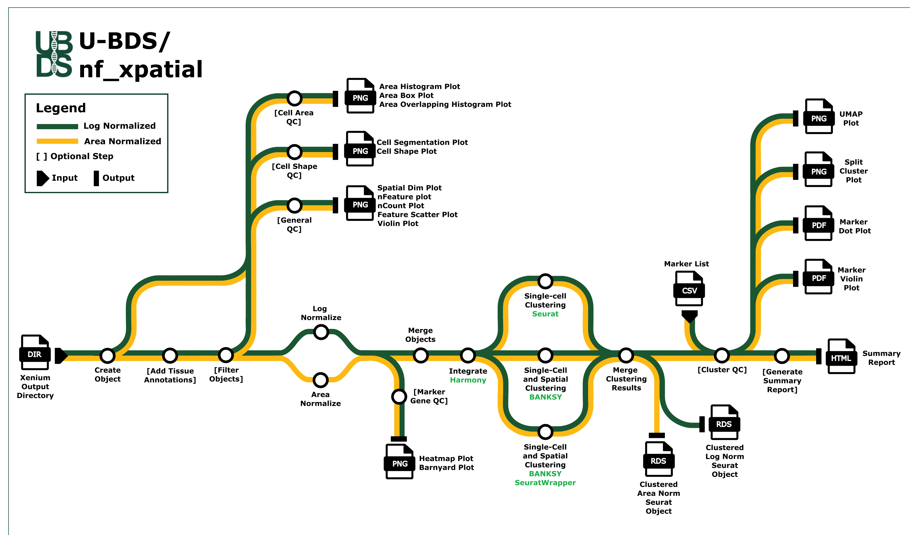

# U-BDS/nf_xenium_analysis

[](https://github.com/U-BDS/nf_xenium_analysis/actions/workflows/ci.yml)
[](https://github.com/U-BDS/nf_xenium_analysis/actions/workflows/linting.yml)[](https://doi.org/10.5281/zenodo.XXXXXXX)
[](https://www.nf-test.com)

[](https://www.nextflow.io/)
[](https://www.docker.com/)
[](https://sylabs.io/docs/)

- [U-BDS/nf\_xenium\_analysis](#u-bdsnf_xenium_analysis)
  - [Introduction](#introduction)
  - [Pipeline Summary](#pipeline-summary)
  - [Usage](#usage)
  - [Outputs](#outputs)
  - [Notes](#notes)
  - [Credits](#credits)
  - [Contributions and Support](#contributions-and-support)
  - [Citations](#citations)


## Introduction

**U-BDS/nf_xpatial** is a best-practices bioinformatics pipeline written in Nextflow that can be used to perform tertiary analysis on 10X Xenium data. It uses the output directories produced by the Xenium Analyzer instrument as input and performs quality control, filtering, normalization, and clustering, and generates configurable figures that can be reviewed individually or in the final summary report.

## Pipeline Summary



1. Create Seurat object from Xenium output
2. Generate QC images for initial seurat object
   1. Cell Area QC (`Area Box Plot`, `Area Histogram Plot`, `Overlapping Histogram Plot`)
   2. Cell Shape QC (`Cell Segmentation Proportion Plot`, `Cell Shape Proportion Plot`)
   3. Gene Pair QC (`Barnyard Plot`, `Heatmap Plot`)
   4. General QC (`Image Dim Plot`, `nFeature/nCount Violin Plot`, `nFeature/nCount Feature Scatter Plot`, `nFeature Dim Plot`, `nCount Dim Plot`)
3. Filter the Seurat object
4. Generate QC images for filtered seurat object
   1. Cell Area QC (`Area Box Plot`, `Area Histogram Plot`, `Overlapping Histogram Plot`)
   2. Cell Shape QC (`Cell Segmentation Proportion Plot`, `Cell Shape Proportion Plot`)
   3. Gene Pair QC (`Barnyard Plot`, `Heatmap Plot`)
   4. General QC (`Image Dim Plot`, `nFeature/nCount Violin Plot`, `nFeature/nCount Feature Scatter Plot`, `nFeature Dim Plot`, `nCount Dim Plot`)
5. Normalize the Seurat object (Choose between `area normalization`, `log normalization`, or `both`)
6. Merge normalized Seurat objects
7. Perform Seurat clustering for single-cell clustering
   1. Scale data
   2. Run PCA
   3. Run Harmony
   4. Run UMAP
   5. Find Neighbors
   6. Find Clusters
8. Perform BANKSY clustering for single-cell and spatial-domain clsutering
   1. Convert to Spatial Experiment
   2. Stagger Spatial Coordinates
   3. Compute BANKSY Matrix
   4. Compute BANKSY PCA 
   5. Run Harmony BANKSY
   6. Run BANKSY Umap
9. Merge BANKSY and Seurat clustered objects into a single object
10. Generate Cluster QC images (This is done for all parameter combinations) (`UMAP Dim Plot`, `Split Cluster Plot`, `Marker Violin Plot`, `Marker Dot Plot`)
11. Generate final summary report

## Usage

First, prepare a csv file containing metadata for the samples you wish to analyze. You can create separate metadata csv's for each sample or create a single metadata csv that contains information for all samples. (The only required columns in this file are `SampleID` and `BiologicalGroup`, however you can add additional columns that will be stored on the seurat object)

`metadata.csv`

```csv
SampleID,BiologicalGroup
XNM001,Control
XNM002,Treatment
XNM003,Control
XNM004,Treatment
```

If you have any tissue annotations, i.e. regions that you have drawn and labelled using the Xenium Explorer, you are able to add these onto the seurat object. Once the annotations are exported outside of Xenium Explorer, these will need to be reformatted so that all the annotations are in a tab-delimited file with the columns `Cell_ID` and `Tissue_annotation`. To assist with this step, we provide a script in this repository (`bin/gather_xenium_explorer_annotations.csv`) that can be used to process the exports from Xenium Explorer into the format needed by this pipeline.

Additionally, this step can also be used to remove parts of a slide by labelling the region you wish to remove as `REMOVE` in Xenium Explorer. The most common use cases for this are to remove parts of sample that has folded over on itself or to remove regions that are from a different sample (NOTE: The pipeline does not currently have a way to add these regions back to the sample it belongs to)

Finally, prepare a samplesheet with your input data that looks as follows:

`samplesheet.csv`:

```csv
sample,xenium,metadata,manual_annotation
XNM001,/path/to/XNM001_xenium_output,/path/to/xenium_metadata.csv,/path/to/XNM001_manual_annotation.csv
XNM002,/path/to/XNM002_xenium_output,
XNM003,/path/to/XNM003_xenium_output,
XNM004,/path/to/XNM004_xenium_output,/path/to/xenium_metadata.csv,/path/to/XNM004_manual_annotation.csv
```

Each row represents a directory produced by the Xenium Analyzer instrument.

Now, you can run the pipeline using:

```bash
nextflow run U-BDS/nf_xpatial \
   -profile <docker/singularity/.../institute> \
   --input samplesheet.csv \
   --normalization_method "area,log" \
   --dim_Seurat "5,10,15,25" \
   --res_Seurat "0.4,0.5,0.6,0.7" \
   --lambda_BANKSY "0.0,0.2,0.8,0.9" \
   --k_geom_BANKSY "15,30" \
   --nPCs_BANKSY "20,30" \
   --res_BANKSY "0.4,0.5,0.6,0.7,0.8,0.9,1.0" \
   --outdir <OUTDIR>
```

> [!WARNING]
> Please provide pipeline parameters via the CLI or Nextflow `-params-file` option. Custom config files including those provided by the `-c` Nextflow option can be used to provide any configuration _**except for parameters**_;

## Outputs
`U-BDS/nf_xpatial` produces a number of files and figures that can be used to review the quality of the data and refine parameters. However, the main output of this pipeline are `.rds` objects that contain all clustering results into a central object. An `.rds` object is created for each normalization method specified by the `--normalization_method` pipeline parameter.

Because these objects contain all clustering results and all dimension reductions they can be quite large, making it prudent to filter these objects to a single (or selection) of parameter combinations. In order to do that, its important to note how data is stored on each object:

1. Each normalization stores its result in a specific assay, `log_norm` stores its data in the `Xenium` assay, while `area_norm` stores its data in the `AreaNorm` assay. 
2. The clustering calls are stored in the objects metadata with the regex `clust_HMY_d*_r*` (where d is the dimension and r is the resolution) for Seurat clusters and `clust_BSKY_l*_k*_n*_r*` (where l is lambda, k is k_geom, n is nPCs, and r is resolution) for BANKSY clusters.
3. UMAP dimension reductions are accessible using the regex `Harmony_umap_d` (where d is the dimension) for Seurat reductions and  `BANKSY_UMAPBANKSYharmony_l*.k*.d*` (where l is lambda, k is k_geom, d is nPCs) for BANKSY reductions.

To assist with filtering this object, we provided this [script](assets/filter_xenium_obj.R) (located at `assets/filter_xenium_obj.R`) to perform the filtering as well as listing some examples on how to use the provided script.

For in-depth descriptions and locations of the additional outputs within the results folder, refer to this [document](docs/output.md) (located at `docs/output.md`)

## Notes

- This pipeline can use a gene list via the `--marker_list` flag. The marker list will be used to generate barnyard plots, as well as dot plots and violin plots for each parameter combination. The marker list needs to be a csv with column names 'group' and 'gene'. Dot plots and violin plots will group genes based on the 'group' column and will print each 'group' on a separate page in their pdf output. Both the dot plot and violin plot will split groups to prevent the plots from becoming overcrowded. By default they will separate groups if they are over 50 genes long, and will spread the group out over multiple pages if it is. This can be configured via custom config by modifying the `--max_genes_per_group <INT>` parameter for the `MARKER_DOT_PLOT` and `MARKER_VLN_PLOT` processes.

## Credits

U-BDS/nf_xpatial was originally written by Nilesh Kumar, Luke Potter, Austyn Trull, Lara Ianov.

## Contributions and Support

If you would like to contribute to this pipeline, please see the [contributing guidelines](.github/CONTRIBUTING.md).

## Citations

<!-- TODO: Add citation for pipeline after first release. Uncomment lines below and update Zenodo doi and badge at the top of this file. -->
<!-- If you use U-BDS/nf_xpatial for your analysis, please cite it using the following doi: [10.5281/zenodo.XXXXXX](https://doi.org/10.5281/zenodo.XXXXXX) -->

This pipeline uses code and infrastructure developed and maintained by the [nf-core](https://nf-co.re) initative, and reused here under the [MIT license](https://github.com/nf-core/tools/blob/master/LICENSE).
 
> The nf-core framework for community-curated bioinformatics pipelines.
>
> Philip Ewels, Alexander Peltzer, Sven Fillinger, Harshil Patel, Johannes Alneberg, Andreas Wilm, Maxime Ulysse Garcia, Paolo Di Tommaso & Sven Nahnsen.
>
> Nat Biotechnol. 2020 Feb 13. doi: 10.1038/s41587-020-0439-x.

In addition, an extensive list of references for the tools used by the pipeline can be found in the [`CITATIONS.md`](CITATIONS.md) file.
