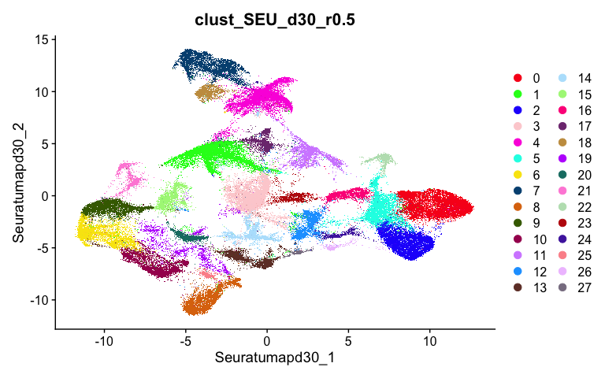
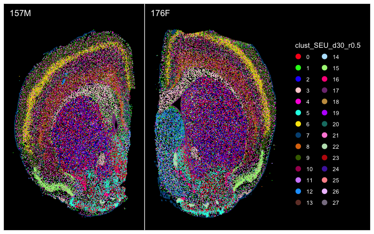
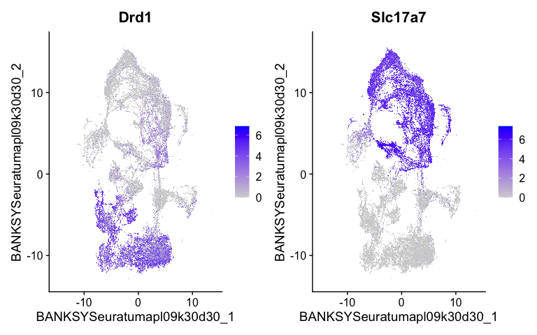

# Xenium Seurat Object Navigation


- [Seurat Object Structure](#seurat-object-structure)
  - [Metadata](#metadata)
  - [Reductions](#reductions)
- [Visualization](#visualization)
  - [UMAP](#umap)
  - [Spatial Plot](#spatial-plot)
  - [Feature Plot](#feature-plot)
- [Filtering the object](#filtering-the-object)

This document is meant to be a reference for working with the Xenium
Seurat object output from the nf_xpatial pipeline. It contains
information about what is included in the object as well as a demo for
how to select various parameters for visualizing the data.

## Seurat Object Structure

Each normalization method (e.g. log-normalization, area normalization)
is stored as a separate Seurat object to reduce the (already large) size
of the object. Clustering metadata as well as dimensionality reductions
are specific for each normalization method, so they are stored within
the respective Seurat object.

For basic information about the structure of a Seurat object, please see
the [Seurat wiki](https://github.com/satijalab/seurat/wiki/seurat).

### Metadata

The Seurat object contains all standard information expected in a Seurat
object, as well as a number of metadata columns specific to the Xenium
data.

Clustering parameters follow a pattern based the following general
format: `clust_[method]_[clustering parameters]`

Current methods include:

- `SEU`: Seurat clustering
- `BSKY`: BANKSY clustering
- `BSKYSEU`: BANSKY’s Seurat wrapper

Clustering parameter options include:

- `d`: Number of PCA dimensions kept for downstream processes
  (e.g. Harmony, UMAP, etc.)
- `r`: Clustering resolution
- `l`: Banksy’s `lambda` parameter. It controls how much weight to give
  to a spatial neighborhood’s transcriptome vs. an individual cell’s
  transcriptome.
- `k`: Banksy’s `k_geom` parameter. It controls the number of cells used
  to create the spatial neighborhood for each cell.

Examples:

- Seurat clustering: `clust_SEU_d30_r0.7` represesnts Seurat clustering
  (after Harmony integration) with 30 dimensions and a resolution of
  0.7.
- Banksy clustering: `clust_BSKY_l0.9_k15_d30_r1.0` represents Banksy
  clustering with a lambda of 0.9, k_geom (spatial neighborhood size) of
  15, 30 dimensions of PCA / Harmony integration utilized, and a
  clustering resolution of 1.0.

### Reductions

Currently, each compiled object already contains all calculated
dimensionality reductions for each clustering parameter (within that
normalization method). This does make a large object, but allows for
faster visualization and exploration of the data without needing to
reload the reductions from disk. We do [provide a helper function
available
here](https://github.com/U-BDS/nf_xpatial/blob/main/assets/filter_xenium_obj.R)
which allows a user to filter down the object to retain only selected
reductions/clustering parameters. An example of its usage is shown later
in this demo.

The reductions also follow a similar naming pattern to the clustering
metadata, currently with the following general format:
`[method]_[reduction]_[clustering parameters]`

Current methods include:

- `Seurat`: Seurat clustering
- `BANKSY`: BANKSY clustering
- `BANKSYSeurat`: BANSKY’s Seurat wrapper

Reductions included are:

- `pca`: Principal Component Analysis
  - Note: PCA reduction names for Seurat-based methods (BANKSY and
    BANKSY’s Seurat wrapper) contain the normalization method
    (e.g. `pcalognorm`, `pcaareanorm`)
- `harmony`: Harmony integration (batch corrected PCA)
- `umap`: Uniform Manifold Approximation and Projection

Clustering parameter options match those seen in the metadata above,
with the exception that reductions are calculated prior to clustering,
so there are no resolution (`r`) parameters in their names.

## Visualization

Here we will demo a basic visualization of a UMAP and spatial plot for
the current log-normalized Seurat object.

``` r
library(Seurat)
library(ggplot2)
library(Polychrome)
library(patchwork)

seurat_object <- readRDS("./compiled_log_norm_all_clusters.rds")
```

### UMAP

``` r
# Default Seurat colors are often difficult to distinguish between for higher number of clusters, so we recommend Polychrome or related packages to generate more flexible color palletes.
clust_colors <- Polychrome::createPalette(
  N = length(unique(seurat_object$clust_SEU_d30_r0.5)), 
  seedcolors = c("#FF0000","#00FF00","#0000FF")
  ) |> as.character()

DimPlot(seurat_object, 
        reduction = "Seurat_umap_d30",
        group.by = "clust_SEU_d30_r0.5") + 
  scale_color_manual(values = clust_colors)
```



### Spatial Plot

``` r
# By default, Image coordinates are stored both flipped and rotated to their original positions on the Xenium slides, so we include some additional steps here to rotate things to their proper orientation for all FOVs.

plot_list <- ImageDimPlot(seurat_object, 
  group.by = "clust_SEU_d30_r0.5", 
  cols = clust_colors, 
  fov = Images(seurat_object), 
  combine = F)

names(plot_list) <- unique(seurat_object$orig.ident)

plot_list <- lapply(names(plot_list), function(name) {
  x <- plot_list[[name]]
  x <- x + 
    coord_flip() + 
    scale_x_reverse() + 
    ggtitle(name)
  })

names(plot_list) <- unique(seurat_object$orig.ident)

plot_combo <- patchwork::wrap_plots(plot_list) + plot_layout(guides = "collect")
plot_combo
```



### Feature Plot

``` r
FeaturePlot(seurat_object, 
  features = c("Drd1", "Slc17a7"))
```



## Filtering the object

Once a user makes a choice of which reductions / parameters to keep for
downstream analysis, we encourage to filter down the object.

Our [helper
function](https://github.com/U-BDS/nf_xpatial/blob/main/assets/filter_xenium_obj.R)
can be implemented in the following manner (please include the source
code linked above in your environment). We provide a couple of different
examples below as this function can be implemented to retain either
multiple parameters or a single one:

``` r
# This will grab all the BANKSY cluster and reductions, filtering out the Seurat cluster results
only_banksy_obj <- filter_xenium_obj(
  input = seurat_object,
  clustering_method = c("BANKSY")
)
only_banksy_obj
```

    An object of class Seurat 
    344 features across 112657 samples within 1 assay 
    Active assay: Xenium (344 features, 344 variable features)
     3 layers present: scale.data, data, counts
     2 spatial fields of view present: fov fov.176F

``` r
# This will grab only the Seurat cluster and reductions for dimension 20 and resolution 0.4
single_seurat <- filter_xenium_obj(
  input = seurat_object,
  clustering_method = c("Seurat"),
  hmy_dims = c(20),
  hmy_res = c(0.4)
)
single_seurat
```

    An object of class Seurat 
    344 features across 112657 samples within 1 assay 
    Active assay: Xenium (344 features, 344 variable features)
     3 layers present: scale.data, data, counts
     2 spatial fields of view present: fov fov.176F

``` r
# This will grab only the Seurat cluster and reductions for dimension 20, 25,and 30 and resolution 0.4
mutliple_dims_seurat <- filter_xenium_obj(
  input = seurat_object,
  clustering_method = c("Seurat"),
  hmy_dims = c(20,25,30),
  hmy_res = c(0.4)
)
mutliple_dims_seurat
```

    An object of class Seurat 
    344 features across 112657 samples within 1 assay 
    Active assay: Xenium (344 features, 344 variable features)
     3 layers present: scale.data, data, counts
     2 spatial fields of view present: fov fov.176F
