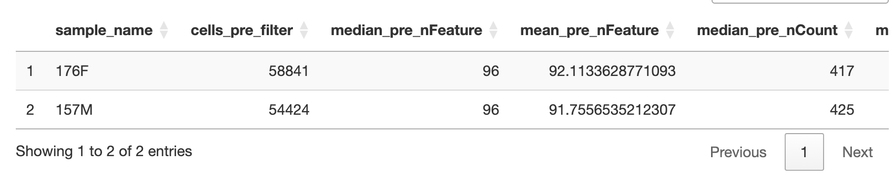
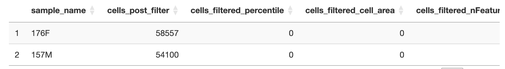
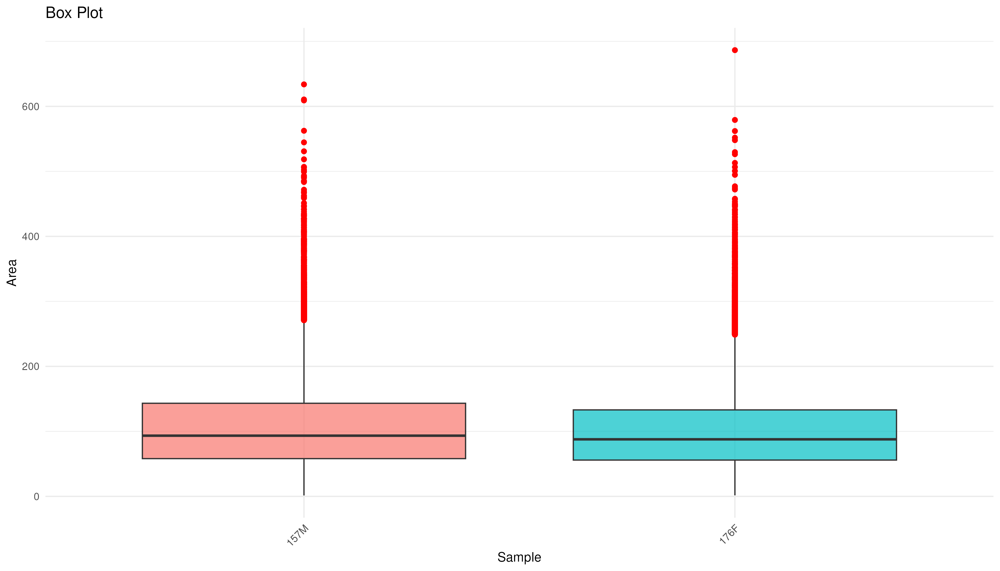
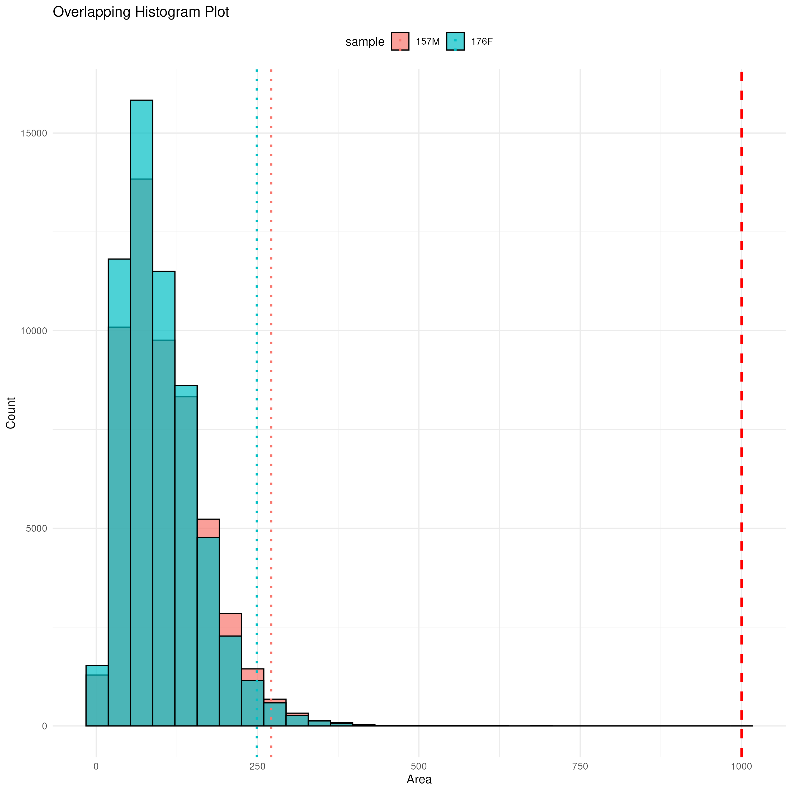
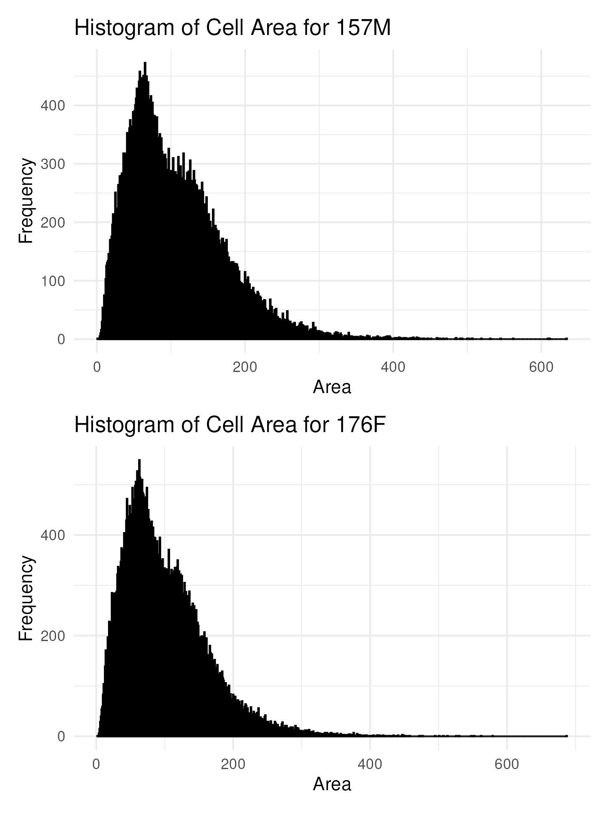

# U-BDS/nf_xpatial: Output

## Introduction

This document describes the output produced by the pipeline. Some images are taken from the summary report produced at the end of the pipeline.

The directories listed below will be created in the results directory after the pipeline has finished. All paths are relative to the top-level results directory.

## Pipeline overview

The pipeline is built using [Nextflow](https://www.nextflow.io/) and processes data using the following steps:

- [U-BDS/nf\_xpatial: Output](#u-bdsnf_xpatial-output)
  - [Introduction](#introduction)
  - [Pipeline overview](#pipeline-overview)
  - [Initial Processing](#initial-processing)
    - [Sample Statistics](#sample-statistics)
    - [Cell Area QC](#cell-area-qc)
    - [Cell Segmentation QC](#cell-segmentation-qc)
    - [General QC](#general-qc)
    - [Manual Annotation QC](#manual-annotation-qc)
  - [Normalization](#normalization)
    - [Gene Marker QC](#gene-marker-qc)
  - [Clustering](#clustering)
    - [Cluster QC](#cluster-qc)
  - [Final Outputs](#final-outputs)
    - [Merged Seurat Objects](#merged-seurat-objects)
    - [Summary Report](#summary-report)

## Initial Processing

### Sample Statistics

Output files

- `<sample_identifier>/`
  - `filtered/`
    - `*.filtered.csv`: The csv containing statistics for each sample for both pre- and post-filtering values

Sample statistics are produced when samples are filtered. The csv's contain cell counts, median nFeature, mean nFeature, median nCount, and mean nCount for both pre- and post-filtered data. Post-filtered statistics also include columns indicating how many cells were not able to pass individual filters.

### Cell Area QC

Output files

- `compiled/`
  - `filtered/`
    - `qc/`
      - `cell_area_qc/`
        - `compiled_filtered_box_plot.png`: The box plot displaying the cell areas for each cell that passed filtering, separated by sample.
        - `compiled_filtered_overlapping_histogram_plot.png`: The histogram plot containing cell areas for each cell that passed filtering, separated by sample, with each histogram overlapped onto each other. 
        - `compiled_histogram_plot.png`: A series of tiled histogram plots that plot the cell areas for each cell that passed filtering, separated by sample.
  - `raw/`
    - `qc/`
      - `cell_area_qc/`
        - `compiled_filtered_box_plot.png`: The box plot displaying the cell areas for each cell, separated by sample.
        - `compiled_filtered_overlapping_histogram_plot.png`: The histogram plot containing cell areas for each cell, separated by sample, with each histogram overlapped onto each other. 
        - `compiled_histogram_plot.png`: A series of tiled histogram plots that plot the cell areas for each cell, separated by sample.

    
    
    

The areas for each cell are calculated within the pipeline. We expect that in most cases, the areas to be consistent across all samples. Deviations from these assumptions can indicate issues with cell segmentation or that tissue sections are too dissimilar which can lead to issues or incorrect results in downstream analysis.

### Cell Segmentation QC

### General QC

### Manual Annotation QC

## Normalization

### Gene Marker QC

## Clustering

### Cluster QC

## Final Outputs

### Merged Seurat Objects

### Summary Report