# U-BDS/nf_xpatial: Output

## Introduction

This document describes the output produced by the pipeline. Some images are taken from the summary report produced at the end of the pipeline.

The directories listed below will be created in the results directory after the pipeline has finished. All paths are relative to the top-level results directory.

## Pipeline overview

The pipeline is built using [Nextflow](https://www.nextflow.io/) and processes data using the following steps:

- [U-BDS/nf\_xpatial: Output](#u-bdsnf_xpatial-output)
  - [Introduction](#introduction)
  - [Pipeline overview](#pipeline-overview)
  - [Initial Processing](#initial-processing)
    - [Sample Statistics](#sample-statistics)
    - [Cell Area QC](#cell-area-qc)
    - [Cell Shape QC](#cell-shape-qc)
    - [General QC](#general-qc)
    - [Manual Annotation QC](#manual-annotation-qc)
  - [Normalization](#normalization)
    - [Gene Marker QC](#gene-marker-qc)
  - [Clustering](#clustering)
    - [Cluster QC](#cluster-qc)
  - [Final Outputs](#final-outputs)
    - [Merged Seurat Objects](#merged-seurat-objects)
    - [Summary Report](#summary-report)

## Initial Processing

### Sample Statistics

Output files

- `<sample_identifier>/`
  - `filtered/`
    - `*.filtered.csv`: The csv containing statistics for each sample for both pre- and post-filtering values

  
  

Sample statistics are produced when samples are filtered. The csv's contain cell counts, median nFeature, mean nFeature, median nCount, and mean nCount for both pre- and post-filtered data. Post-filtered statistics also include columns indicating how many cells were not able to pass individual filters.

### Cell Area QC

Output files

- `compiled/`
  - `filtered/`
    - `qc/`
      - `cell_area_qc/`
        - `compiled_filtered_box_plot.png`: The box plot displaying the cell areas for each cell that passed filtering, separated by sample.
        - `compiled_filtered_overlapping_histogram_plot.png`: The histogram plot containing cell areas for each cell that passed filtering, separated by sample, with each histogram overlapped onto each other. 
        - `compiled_histogram_plot.png`: A series of tiled histogram plots that plot the cell areas for each cell that passed filtering, separated by sample.
  - `raw/`
    - `qc/`
      - `cell_area_qc/`
        - `compiled_filtered_box_plot.png`: The box plot displaying the cell areas for each cell, separated by sample.
        - `compiled_filtered_overlapping_histogram_plot.png`: The histogram plot containing cell areas for each cell, separated by sample, with each histogram overlapped onto each other. 
        - `compiled_histogram_plot.png`: A series of tiled histogram plots that plot the cell areas for each cell, separated by sample.

  
  
  

The areas for each cell are calculated within the pipeline. We expect that in most cases, the areas to be consistent across all samples. Deviations from these assumptions can indicate issues with cell segmentation or that tissue sections are too dissimilar which can lead to issues or incorrect results in downstream analysis.

### Cell Shape QC

Output Files

- `compiled/`
  - `filtered/`
    - `qc/`
      - `cell_shape_qc/`
        - `compiled.cell_segmentation_proportion_plot.png`: The proportion plot plotting how cells that passed filtering were segmented by Xenium, separated by sample
        - `compiled.cell_shape_proportion_plot.png`: The proportion plot plotting the estimated shape of each cell that passed filtering, separated by sample
  - `raw/`
    - `qc/`
      - `cell_shape_qc/`
        - `compiled.cell_segmentation_proportion_plot.png`: The proportion plot plotting how cells were segmented by Xenium, separated by sample
        - `compiled.cell_shape_proportion_plot.png`: The proportion plot plotting the estimated shape of each cell, separated by sample

    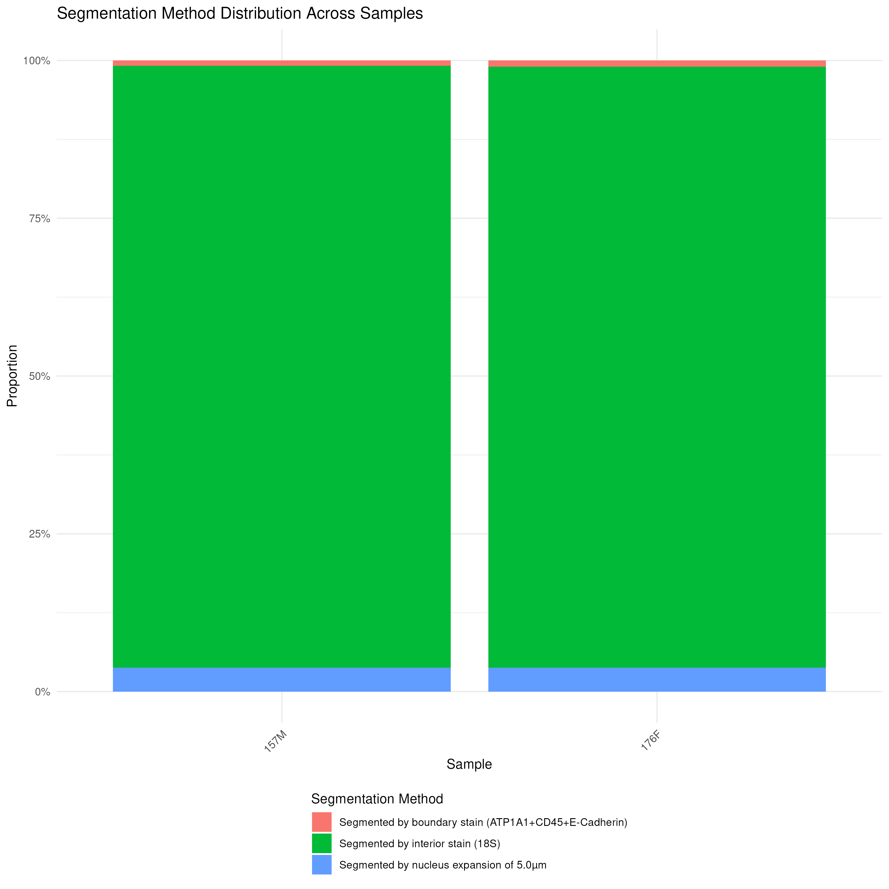
    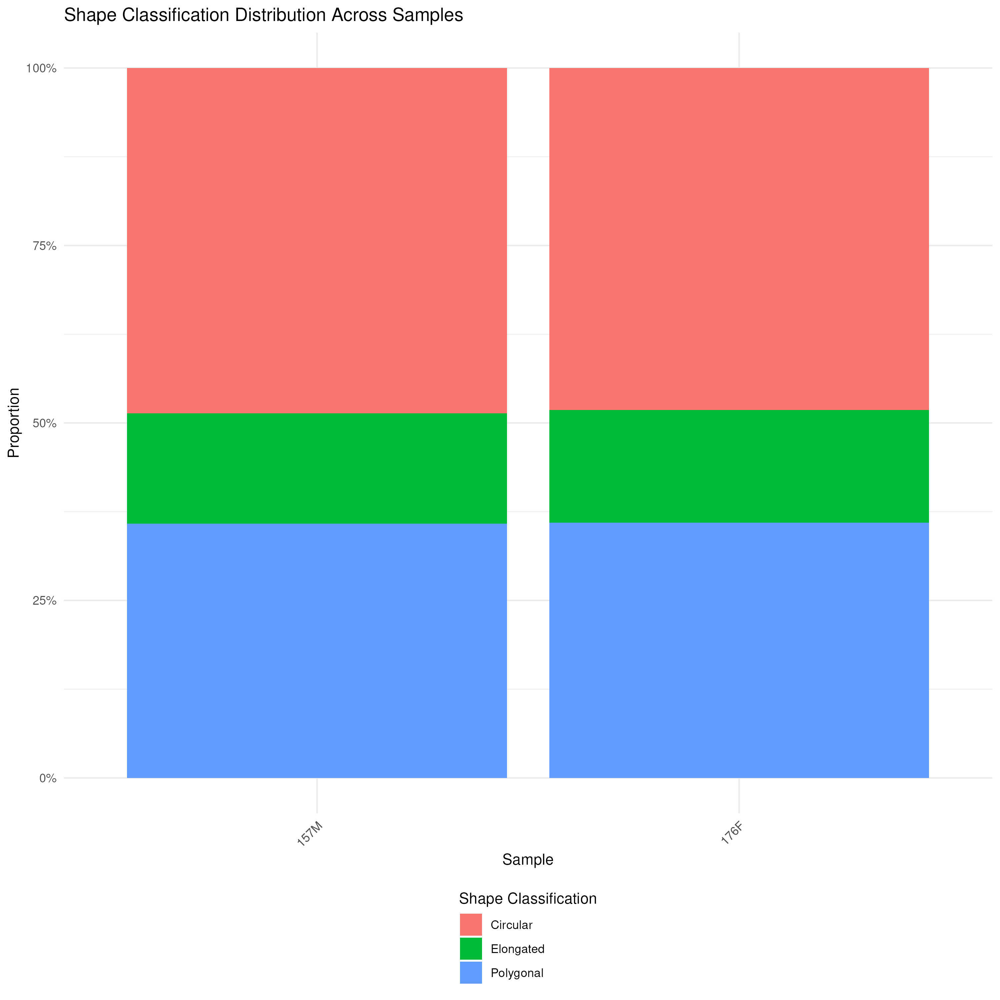

The cell segmentation proportion plot is based on data provided by Xenium, if multimodal segmentation is selected, this breaks down how many cells were segmented using the different methods.

The cell shape proportion plot is based on data calculated by the pipeline. Cells are categorized into three categories: Elongated, Poygonal, and Circular based on their circularity and aspect ratio. Circularity of cells is calculated using this formula: `(4 * pi * polygon_area) / (perimeter^2)`. Aspect ratio of cells is calculated using this formula: `(max(x_coords) - min(x_coords)) / (max(y_coords) - min(y_coords))`. Cells are classified into the previously mentioned categories based on the following criteria:
- 'circular': if a cell's circularity is greater than 0.8.
- 'polygonal': if a cell's aspect ratio is greater than 0.8 and less than or equal to 1.2
- 'elongated' if a cells aspect ratio is greater than 1.2.

Both of these plots are additional ways to ensure there are no issues with cell segmentation and that tissue sections are not too dissimilar, as we would expect both of these plots to have proportions similar across all samples. 

### General QC

Output Files

- `compiled/`
  - `filtered/`
    - `qc/`
      - `compiled_dim_plot.png`: Dim plot to display BiologicalGroup for filtered data.
      - `compiled_feature_scatter_plot.png`: nFeature vs nCount feature scatter plot for filtered data.
      - `compiled.qc_ncount_image_feature_plot.png`: Feature plot showing ncount across the filtered samples.
      - `compiled.qc_nfeature_image_feature_plot.png`: Feature plot showing nfeature across the filtered samples.
      - `compiled_vln_plot.png`: Violin plots for nFeature and nCount information for each post-filtered sample.
  - `raw_data/`
    - `qc/`
      - `compiled_dim_plot.png`: Dim plot to display BiologicalGroup.
      - `compiled_feature_scatter_plot.png`: nFeature vs nCount feature scatter plot.
      - `compiled.qc_ncount_image_feature_plot.png`: Feature plot showing ncount across the samples.
      - `compiled.qc_nfeature_image_feature_plot.png`: Feature plot showing nfeature across the samples.
      - `compiled_vln_plot.png`: Violin plots for nFeature and nCount information for each sample.

    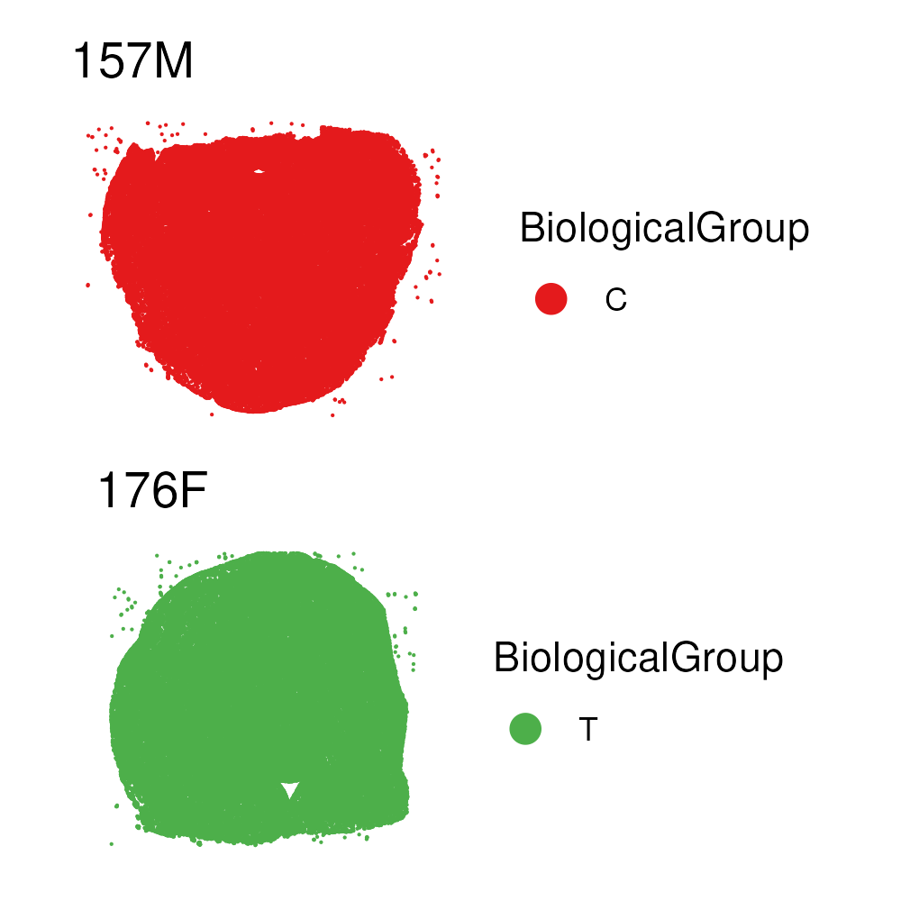
    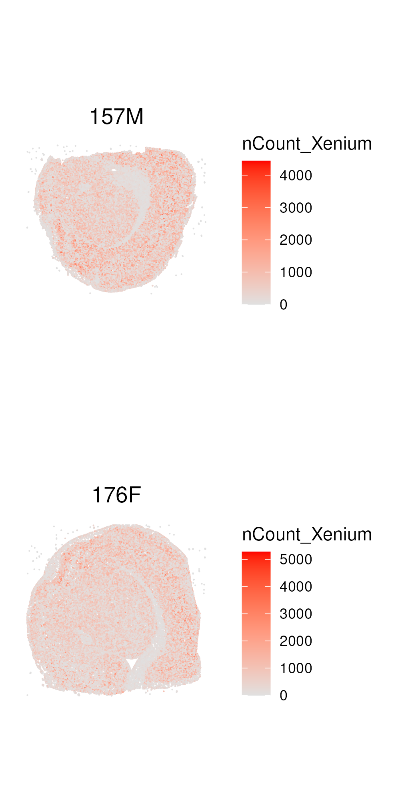
    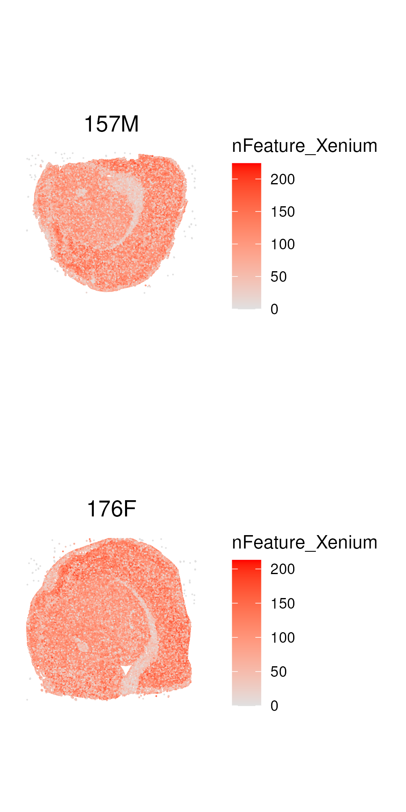
    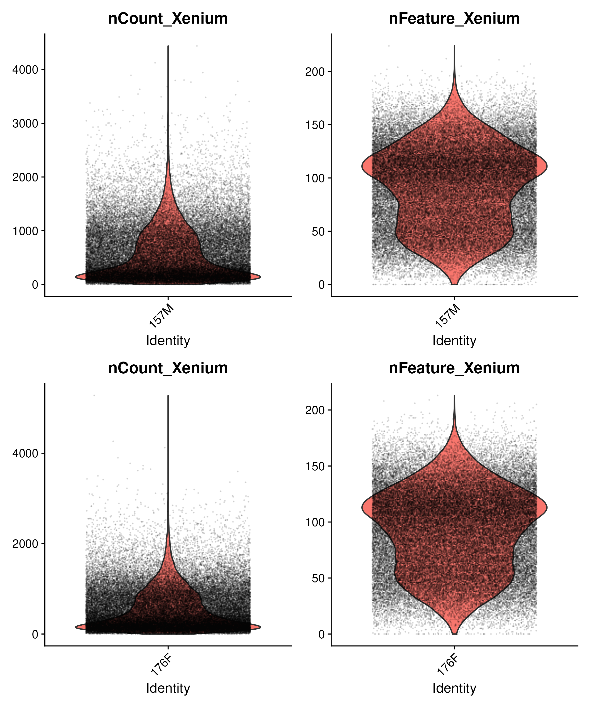

These are various images that can be used to assess quality of the data. We provide these same plots both pre-and post-filtering.

### Manual Annotation QC

Output Files

- `compiled/`
  - `manual_annotations/`
    - `compiled_annotated_dim_plot.png`: The image dim plot that displays user-entered (often anatomical or pathological) regions for each sample that has an annotation

Manual annotations are a way for users to annotate regions of tissue that can be added to the R object. The dim plot displays the regions overlaid onto each sample.

## Normalization

### Gene Marker QC

Output Files

- `<sample_identifier>/`
  - `normalized/`
    - `area_norm/`
      - `qc/`
        - `gene_pair_qc/`
          - `<gene1>_<gene2>.<sample_identifier>_barnyard_plot.png`: The barnyard plot for the area normalized data that compares expression of two genes across all cells.
    - `log_norm/`
      - `qc/`
        - `gene_pair_qc/`
          - `<gene1>_<gene2>.<sample_identifier>_barnyard_plot.png`: The barnyard plot for the log normalized data that compares expression of two genes across all cells.

    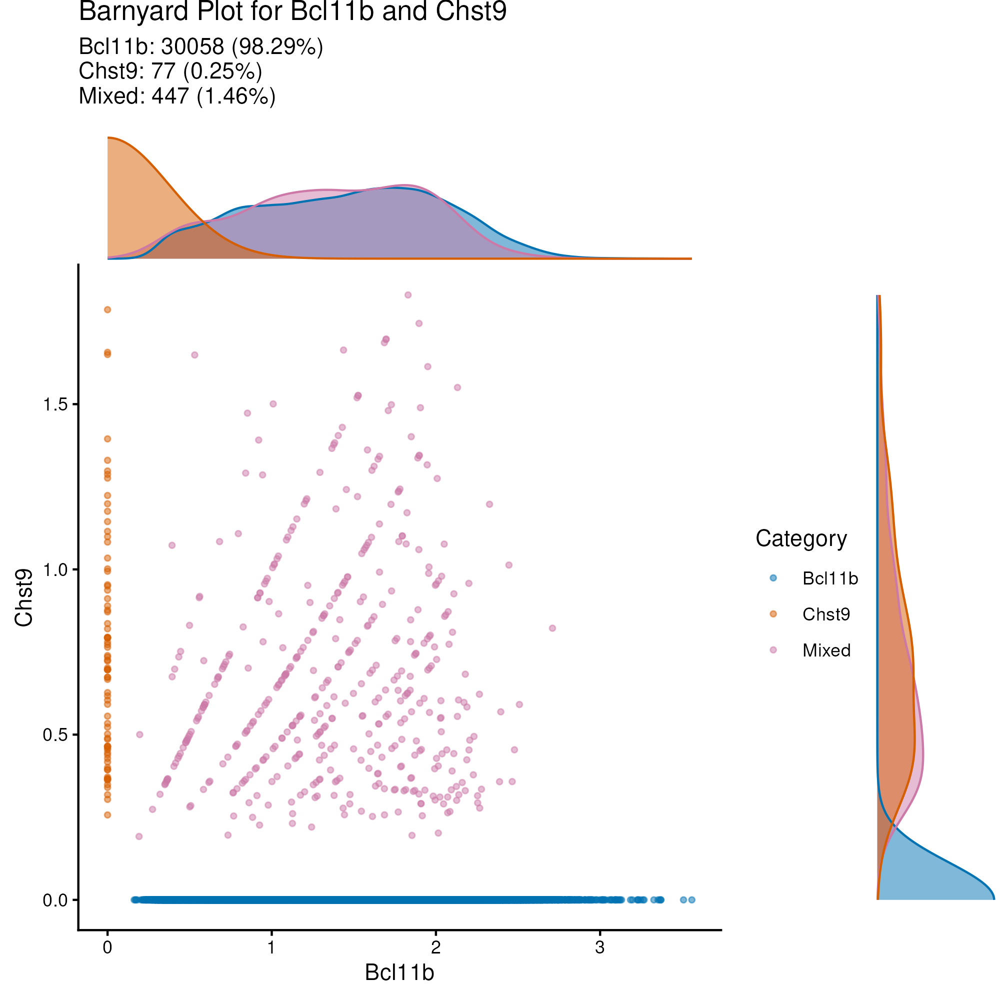

Barnyard plots compare expression between two genes. These can be useful plots to help determine if there are issues with cell segmentation. For example, if two marker genes that you would expect to be mutually exclusive within cells but have a large amount of shared expression, this can be indicative of an issue.

Notably, barnyard plots only display the top 10 gene pairs with the highest Spearman's rank correlation coefficient. The primary reason we do this filtering is to limit how many plots are generated by default. There are a number of parameters that can be used to further filter or limit how many gene pairs are evaluated, both at the pipeline level and at the process level for the `FILTER_GENE_PAIRS` process.

## Clustering

### Cluster QC

Output Files

- `compiled/`
  - `clustering_results/`
    - `Seurat/` and `BANKSY/` and `BANKSYSeurat/`
      - `area_norm/` and `log_norm/`
        - `qc/`
          - `dot_plots/`
            - `compiled_area_norm_Seurat.d<dimension>_r<resolution>.dot_plot.pdf`: The multipage dot plot that plots the user-provided marker gene list across all clusters for a specific parameter combination. Each gene_group is presented on a separate page. Each clustering parameter combination is a separate file.
          - `split_cluster_plots/`
            - `compiled_area_norm_Seurat.d<dimension>_r<resolution>_split_cluster_plot.png`: This plot contains cluster umaps and spatial dim plots where cells in the spatial plot are colored based on color number. Both plots that are present are separated by sample. Each clustering parameter combination is a separate file.
          - `umap_dim_plot/`
            - `compiled_area_norm_Seurat.d<dimension>_r<resolution>.png`: The umap plot. Each clustering parameter combination is a separate file.
          - `vln_plots/`
            - `compiled_area_norm_Seurat.d<dimension>_r<resolution>.vln_plot.pdf`: The multipage violin plot that plots the user-provided marker gene list across all clusters for a specific parameter combination. Each gene_group is presented on a separate page. Each clustering parameter combination is a separate file.

    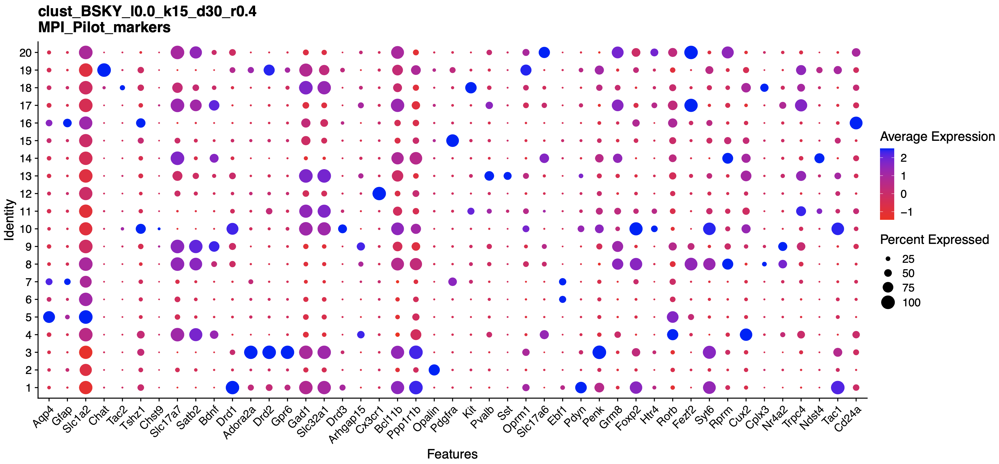
    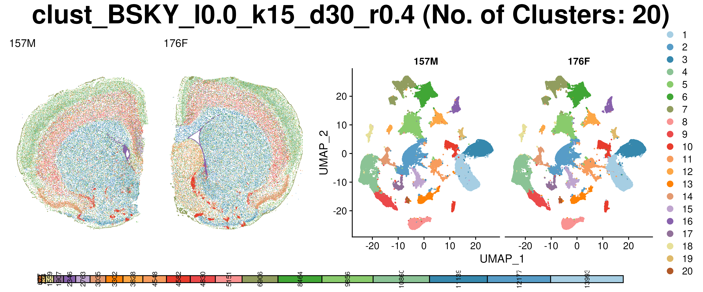
    
    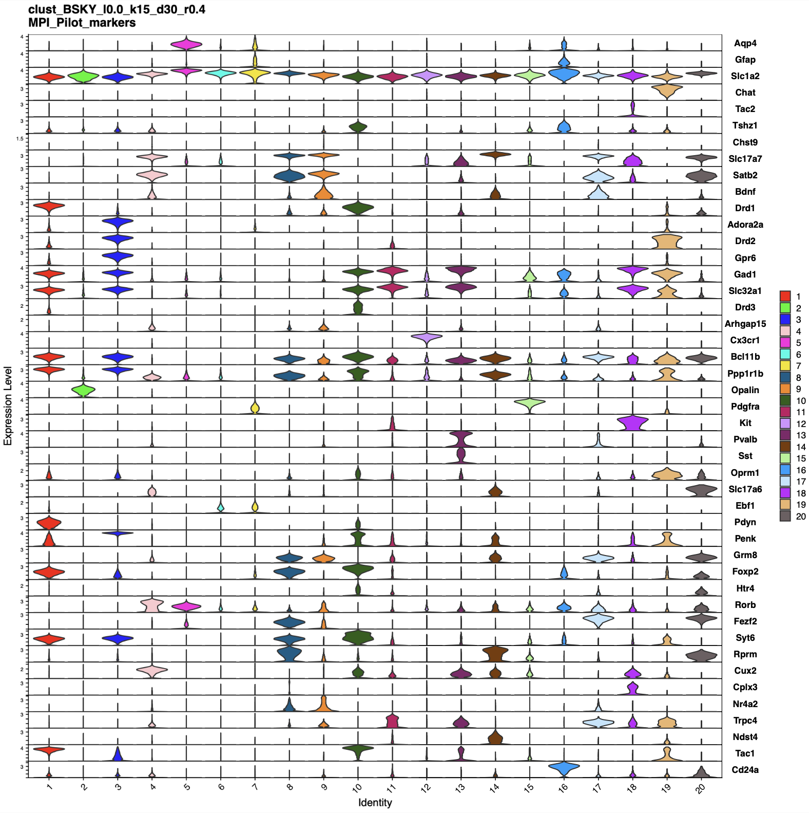

For each clustering method offered by this pipeline, the split cluster plot and the umap plot are generated for each parameter combination provided to the pipeline.

If the user provides a marker gene list, dot plots and violin plots are generated for each parameter combination to assist in deciding the optimal cluster parameters.

## Final Outputs

### Merged Seurat Objects

Output Files

- `compiled/`
  - `compiled_area_norm_all_clusters.rds`: The final RDS object that contains all the clustering and dimension reductions from all parameter combinations into a single object for area normalization.
  - `compiled_log_norm_all_clusters.rds`: The final RDS object that contains all the clustering and dimension reductions from all parameter combinations into a single object for log normalization.

The final objects contain all the clustering and dimension reductions onto single objects, for help on how to access the different results refer to the [nf_xpatial_navigation document](./nf_xpatial_navigation.md).

### Summary Report

Output Files

- `summary_report.html`: The html report that compiles various figures and notes for easier review.

    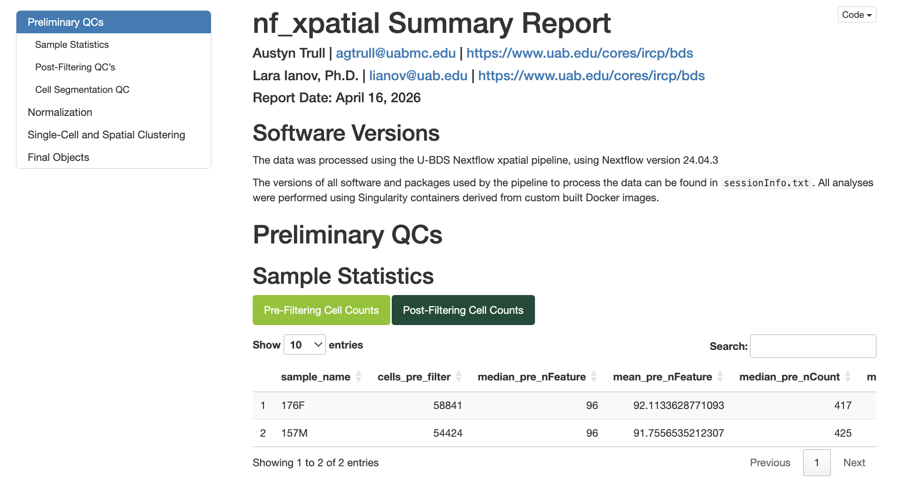

The summary report compiles and provides descriptions for various figures produced by this pipeline. This report also compiles the various clustering qc images into videos to assiste with review. It should be noted that the for the dot and violin plots, only the first gene group is displayed.